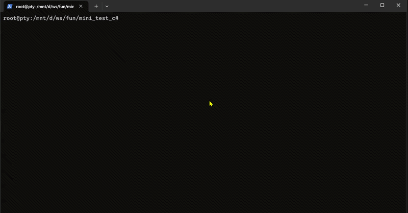

# Mini Browser — 终端 TUI 浏览器

一个基于终端的迷你浏览器引擎，在终端中渲染 HTML + CSS，支持交互操作（焦点切换、按钮点击、输入框编辑）。



## 快速开始

```bash
# 运行默认页面（测试菜单）
./run.sh

# 指定页面
./run.sh pages/01-complex-form.html

# 或直接编译运行（支持 cosmocc、tcc 和 gcc）
# cosmocc（Actually Portable Executable）:
cosmocc -x c -I src -o /tmp/mini_browser.com src/demo.c && /tmp/mini_browser.com [page.html]

# tcc（推荐，最快）:
tcc -I src -run src/demo.c [page.html]

# gcc:
gcc -I src -o /tmp/mini_browser src/demo.c -lm && /tmp/mini_browser [page.html]
```

> 支持 [cosmocc](https://github.com/jart/cosmopolitan)（生成 Actually Portable Executable）、[tcc](https://bellard.org/tcc/)（Tiny C Compiler，推荐）和 GCC 编译。
> `run.sh` 自动检测编译器，优先级：cosmocc > tcc > gcc。

## 使用方法

### 页面文件

测试页面位于 `pages/` 目录下，每个 HTML 文件专注测试一个功能特性：

```
pages/
├── 00-menu.html              # 主菜单（默认页面，14 个测试入口）
├── 01-text-colors.html       # 文本 & 颜色（hex/named/rgb, bold, italic, underline, text-align, text-transform）
├── 02-box-model.html         # 盒模型（padding, margin, border, outline, box-sizing, min/max-width）
├── 03-inputs.html            # 输入框（text, password, focus, cursor, placeholder, Save/Clear/Reset）
├── 04-buttons.html           # 按钮（hover, active, 多色样式, sizes, block）
├── 05-flex-direction.html    # Flex 方向（row/column, space-between, space-evenly, center）
├── 06-flex-justify.html      # Flex 对齐（flex-start, center, flex-end, space-between/around/evenly）
├── 07-flex-align-wrap.html   # Flex 对齐 & 换行（align-items, gap, flex-wrap/nowrap）
├── 08-tables.html            # 表格（table, colspan, striped, colored, thead/tbody）
├── 09-lists-pseudo.html      # 列表 & 伪类（ul/ol, :first-child, :last-child, :nth-child, :only-child）
├── 10-details-textarea.html  # 折叠面板 & 多行输入（details/summary toggle, textarea scroll）
├── 11-select.html            # 下拉选择（select, option 循环, optgroup, menu bar）
├── 12-css-effects.html       # CSS 效果（::before/::after, position, z-index, @media, outline）
├── 13-input-types.html       # 输入类型（checkbox, radio, range, color, number）
└── 14-text-styles.html       # 文本样式（inline-block, del/s/ins, code/kbd/samp, rgb(), currentColor）
```

### 键盘操作

| 按键 | 功能 |
|:--|:--|
| `Tab` | 下一个可聚焦元素（按钮 / 输入框 / select / textarea / summary） |
| `Shift+Tab` | 上一个可聚焦元素 |
| `Enter` | 点击当前聚焦的按钮 / 切换 `<summary>` 折叠 / 循环 `<select>` 选项 |
| `Enter`（textarea） | 输入框中换行 |
| `Esc` | 退出 |
| 任意字符键 | 在输入框中输入文本 |
| `←` / `→` | 输入框中光标左/右移动 |
| `Home` / `End` | 输入框中光标到开头/末尾 |
| `Delete` / `Backspace` | 输入框中删除光标处/前一个字符 |

> 鼠标点击 + 滚轮也支持（终端需启用鼠标事件）。

### 页面跳转

- 按钮 `id` 为 `btn-page-NN` 时，自动跳转到 `pages/NN-*.html`（当前支持 01~14）
- 按钮 `id` 为 `btn-back` 或 `btn-back-N` 时，返回菜单 `00-menu.html`

---

## 运行原理

```
HTML (.html 含 <style>)
    │
    ▼
┌──────────────────┐
│Gumbo (HTML 解析) │  →  DOM 树
└──────────────────┘
    │
    ▼
┌──────────────────┐
│Katana (CSS 解析) │  →  样式表
└──────────────────┘
    │
    ▼
┌──────────────────┐
│  StyleTree       │  →  样式树（选择器匹配 + 属性继承）
└──────────────────┘
    │
    ▼
┌──────────────────┐
│Layout (Box/Flex) │  →  布局树（盒模型 + Flexbox）
└──────────────────┘
    │
    ▼
┌──────────────────┐
│Render (Termbox2) │  → 终端 24-bit 真彩色渲染
└──────────────────┘
    │
    ▼
┌──────────────────┐
│Interact          │  → 交互循环（焦点、点击、输入）
└──────────────────┘
```

### 核心模块

| 模块 | 文件 | 职责 |
|:--|:--|:--|
| **Public API** | `src/core/mini_browser.h` | **最小化接口 — 只需包含它 (stb-style)** |
| **入口 + 按钮回调** | `src/demo.c` | 使用 mini_browser.h API，内联按钮行为配置 |
| **交互框架** | `src/core/interact.h` | 交互循环、焦点遍历、事件分发、输入编辑 |
| **渲染引擎** | `src/core/render.h` | 屏幕缓冲、节点渲染、边框/表格绘制 |
| **布局引擎** | `src/core/layout.h` | 盒模型、Flexbox 布局计算 |
| **样式引擎** | `src/core/styletree.h` | 样式树构建、选择器匹配、属性继承 |
| **HTML 解析** | `src/core/gumbo.h` | Gumbo HTML 解析器（header-only） |
| **CSS 解析** | `src/core/katana.h` | Katana CSS 解析器（header-only） |
| **终端 I/O** | `src/core/termbox2.h` | 终端输入/输出 |
| **Unicode 工具** | `src/core/uc.h` | UTF-8 编解码支持 |

所有核心模块均为 **header-only**（通过 `#define XXX_IMPLEMENTATION` 控制实例化）。

---

## API 设计

`src/core/mini_browser.h` 提供了最小化接口：

```c
// ── 一键模式 (3 行) ──
#define MINI_BROWSER_IMPLEMENTATION
#include "core/mini_browser.h"
mini_browser_run("page.html");

// ── 高级模式 ──
MB_Config cfg = { .on_button_click = my_callback, .on_key = NULL, .show_scrollbars = true };
MiniBrowser* mb = mini_browser_open("page.html", &cfg);
mini_browser_run_loop(mb);
mini_browser_close(mb);

// ── 运行时 API (在回调中调用) ──
mb_set_status(mb, "消息");        // 设置状态栏
mb_set_text(mb, "element-id", "文本");  // 按 id 设置元素文本
mb_get_text(mb, "element-id");   // 获取元素文本
mb_set_visible(mb, "id", true);  // 显示/隐藏元素 (需返回 true)
mb_switch_page(mb, "path");      // 切换页面
mb_quit(mb);                     // 退出
```

---

## 已支持的功能

### CSS 选择器

| 类型 | 示例 |
|:--|:--|
| 类型选择器 | `div`, `p`, `h1` |
| 通用选择器 | `*` |
| 类选择器 | `.box`, `.foo.bar` |
| ID 选择器 | `#header` |
| 属性选择器 | `[id]`, `[type="text"]`, `[attr^="val"]`, `[attr$="val"]`, `[attr*="val"]`, `[attr~="val"]`, `[attr\|"val"]` |
| 伪类（结构） | `:first-child`, `:last-child`, `:nth-child(n)`, `:nth-last-child`, `:first-of-type`, `:last-of-type`, `:only-of-type`, `:only-child`, `:empty` |
| 伪类（否定） | `:not()`（支持嵌套选择器） |
| 伪类（复杂公式） | `:nth-child(an+b)`（支持 `3n+1`、`-n+3` 等） |
| 伪类（链接/交互） | `:link`, `:any-link`, `:hover`, `:focus`, `:active` |
| 伪元素 | `::before`, `::after`（`content` 属性） |
| 后代组合器 | `div span` |
| 子组合器 | `div > p` |
| 相邻兄弟 | `h1 + p` |
| 后续兄弟 | `h1 ~ p` |

### CSS 属性

| 属性 | 说明 |
|:--|:--|
| `display` | `block`, `inline`, `flex`, `grid`（降级为 block）, `table`, `inline-block`, `none` |
| `position` | `static`, `relative`（`top`/`left`/`right`/`bottom` + `z-index` 偏移） |
| `width` / `height` | `px`, `%` 单位 |
| `min-width` / `max-width` | 宽度约束（`px` 单位） |
| `min-height` / `max-height` | 高度约束（`px` 单位） |
| `padding` | 简写 1~4 值 |
| `margin` | 简写 1~4 值（支持 `margin: auto` 水平居中，支持负 margin） |
| margin 折叠 | 相邻垂直 margin 取最大值 |
| `border` | 简写 + `px`，Unicode 框线绘制 |
| `border-style` | `solid`, `dashed`, `dotted`, `double`, `heavy`, `rounded`（`groove`/`ridge`/`inset`/`outset` 降级为 solid） |
| `border-color` | `#RRGGBB`, 命名色 |
| `border-width` | 数值 |
| `color` | 前景色 |
| `background-color` | 背景色填充 |
| `outline` | 边框外轮廓（支持 `width` + `color` 简写） |
| `box-sizing` | `content-box`（默认）, `border-box` |
| `overflow` | `hidden`, `auto`, `scroll`（递归裁剪子节点，滚动容器指示器） |
| `visibility` | `hidden`（元素占位不可见） |
| `text-align` | `left`, `center`, `right` |
| `font-weight` | `bold`, `700`, `bolder`（终端粗体 ANSI） |
| `font-style` | `italic`（ANSI `\033[3m` 转义码） |
| `text-decoration` | `underline`（终端下划线）, `overline`（Macron `¯`）, `line-through`（删除线 `-`） |
| `text-transform` | `uppercase`, `lowercase`, `capitalize` |
| `line-height` | 行高（数值，默认 1） |
| `letter-spacing` | 字符间距（`px` 单位） |
| `word-spacing` | 单词间距（`px` 单位） |
| `white-space` | `pre`, `pre-wrap`, `pre-line`（保留空白） |
| `vertical-align` | `top`, `middle`, `bottom` |
| `flex-direction` | `row`, `column` |
| `flex-wrap` | `wrap` 自动折行 |
| `align-content` | `start`, `center`, `end`, `space-between`, `space-around`, `stretch` |
| `flex-grow` | 剩余空间分配 |
| `flex-shrink` | 超出容器时按比例收缩 |
| `flex-basis` | `px` 单位 |
| `justify-content` | `start`, `center`, `end`, `space-between`, `space-around`, `space-evenly` |
| `align-items` | `start`, `center`, `end`, `stretch` |
| `gap` | flex 子元素间距 |
| `@media` 查询 | 基础支持（`min-width`/`max-width`，匹配 `screen`/`all`） |
| 颜色格式 | `#RGB`/`#RRGGBB`、命名色、`rgb(r,g,b)`/`rgba(r,g,b,a)`、`hsl()`/`hsla()`、`transparent`、`currentColor` |
| CSS 关键字 | `inherit`（从父层继承）, `initial`/`unset`（恢复默认） |

### HTML 标签

| 类别 | 标签 |
|:--|:--|
| 块级元素 | `html`, `body`, `div`, `p`, `h1`-`h6`, `ul`, `ol`, `li`, `header`, `footer`, `section`, `article`, `nav`, `main`, `form`, `fieldset`, `legend`, `hr`, `pre`, `details`, `summary`, `textarea`, `select`, `table`, `tr`, `td`, `th`, `dialog`, `figure`, `figcaption` |
| 行内元素 | `span`, `a`, `em`, `strong`, `b`, `i`, `u`, `code`, `small`, `br`, `img`, `input`, `button`, `s`, `del`, `kbd`, `samp` |
| 交互元素 | `<details>` / `<summary>`（折叠/展开，`open` 属性控制默认状态） |
| | `<textarea>`（多行文本编辑，Enter 换行，双向滚动 + 滚动条拖拽） |
| | `<select>` / `<option>` / `<optgroup>`（Tab 聚焦，Enter 循环切换选项，`<optgroup>` 分组显示） |
| | `<input>`（支持 `type="text"` / `type="password"`（`•` 掩码）/ `checkbox`（`[x]`）/ `radio`（`(•)`）/ `range`（滑块）/ `color`（色块）/ `number` / `search` / `email` / `url` / `tel`，以及 `placeholder` 属性） |
| | `<label for="id">`（点击自动聚焦目标输入框） |
| | `<button>`（背景色 + 粗体） |
| | `<a href>`（默认蓝色 + 下划线） |
| 列表 | `<ul>` / `<ol>` / `<li>`（`•` 和 `1.` 前缀） |
| 表格 | `<table>` / `<tr>` / `<td>` / `<th>`（自动列宽 + 等高等列，支持 `colspan`、`rowspan`） |
| | `<thead>` / `<tbody>` / `<tfoot>`（统一按行处理） |
| 其他 | ``（显示 `[alt文本]` 占位符），`<hr>`（`─` 横线），`<pre>`（保留空白和换行） |
| 默认样式 | `<s>` / `<del>`（`line-through` 删除线），`<kbd>` / `<samp>` / `<code>`（深色背景） |
| 隐藏元素 | `<script>`, `<style>` 自动跳过/隐藏 |

### 渲染能力

| 功能 | 说明 |
|:--|:--|
| 24-bit 真彩色 | ANSI `\033[38;2;R;G;Bm` / `\033[48;2;R;G;Bm` |
| 粗体 / 下划线 / 斜体 | ANSI 转义序列 |
| 边框绘制 | 6 种样式，Unicode 框线字符 |
| 表格边框交点 | 自动识别 `┼├┤┴┬` 等交叉字符 |
| 文本对齐 | 居中/右对齐 |
| 文本截断 | 超出宽度显示 `…` |
| 滚动容器 | `overflow: auto/scroll` 裁剪 + 状态栏滚动指示 `▲▼` |
| textarea 滚动条 | 右侧垂直滚动条（`│` 轨道 + `▒` 滑块），支持鼠标拖拽 |
| 显示隐藏 | `display: none`，`visibility: hidden` |
| 焦点指示器 | 选中元素外周条状高亮 |
| 状态栏 | 底部固定行，交互反馈 |
| 输入框编辑 | 实时键盘输入，光标移动（`←`/`→`/`Home`/`End`/`Delete`/`Backspace`） |
| UTF-8 支持 | 中文 / Emoji 多字节字符 |
| 终端 Resize | SIGWINCH 信号处理 + 事件轮询双检测 |
| 鼠标交互 | 点击、悬停（`:hover`）、滚轮滚动、滚动条拖拽、右键查看元素信息 |
| `<dialog>` 模态框 | 深色遮罩 + 内容居中，`open` 属性控制显隐 |

---

## ❌ 不支持的功能

### 🔴 终端限制 — 不可能实现

| 功能/属性 | 原因 |
|:--|:--|
| `opacity`, `box-shadow`, `border-radius` | 终端无法渲染透明、阴影、圆角 |
| `transform`, `transition`, `animation` | 终端无动画/变换能力 |
| `font-family`, `font-size` | 终端固定字体，无法更改 |
| `@font-face`, `@keyframes` | 在终端无实际意义 |
| `<iframe>`, `<video>`, `<audio>`, `<canvas>` | 需要浏览器能力，TUI 中不可用 |
| 终端文本选中/复制 | 终端 TUI 无选择复制机制（可用终端原生选择） |

### 🟡 可实现但工作量大

| 功能/属性 | 说明 | 难度 |
|:--|:--|:--:|
| `float`, `clear` | 需要多遍浮动布局算法，已推荐 Flexbox 替代 | ★★★ |
| `position: absolute / fixed` | 需要引入包含块系统 + 脱离文档流的布局通道 | ★★★ |
| Grid 布局 | 完整的 Grid 布局引擎，含 template/area/fr 单位 | ★★★ |
| 拖拽交互 | 通用拖拽模型（除现有滚动条拖拽外） | ★★★ |

---

## 项目结构

```
├── run.sh                        # 运行脚本
├── pages/                        # 测试页面（HTML + 内联 CSS）
│   ├── 00-menu.html              # 主菜单（默认页面，14 个测试入口）
│   ├── 01-text-colors.html       # 文本 & 颜色
│   ├── 02-box-model.html         # 盒模型
│   ├── 03-inputs.html            # 输入框
│   ├── 04-buttons.html           # 按钮
│   ├── 05-flex-direction.html    # Flex 方向
│   ├── 06-flex-justify.html      # Flex 对齐
│   ├── 07-flex-align-wrap.html   # Flex 对齐 & 换行
│   ├── 08-tables.html            # 表格
│   ├── 09-lists-pseudo.html      # 列表 & 伪类
│   ├── 10-details-textarea.html  # 折叠面板 & 多行输入
│   ├── 11-select.html            # 下拉选择
│   ├── 12-css-effects.html       # CSS 效果
│   ├── 13-input-types.html       # 输入类型
│   └── 14-text-styles.html       # 文本样式
├── src/
│   ├── demo.c                    # 入口：组装模块 + 按钮回调配置
│   └── core/
│       ├── mini_browser.h        # Public API (stb-style single header)
│       ├── gumbo.h               # HTML 解析器
│       ├── interact.h            # 交互框架
│       ├── katana.h              # CSS 解析器
│       ├── layout.h              # 布局引擎
│       ├── render.h              # 渲染引擎
│       ├── styletree.h           # 样式引擎
│       ├── termbox2.h            # 终端 I/O
│       └── uc.h                  # Unicode 工具
├── doc/
│   └── optimization-analysis.md  # 性能优化分析
└── README.md
```
